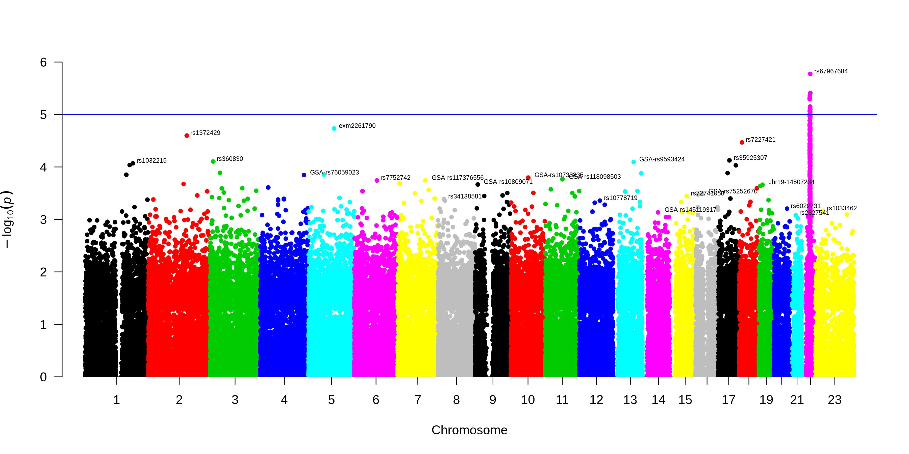
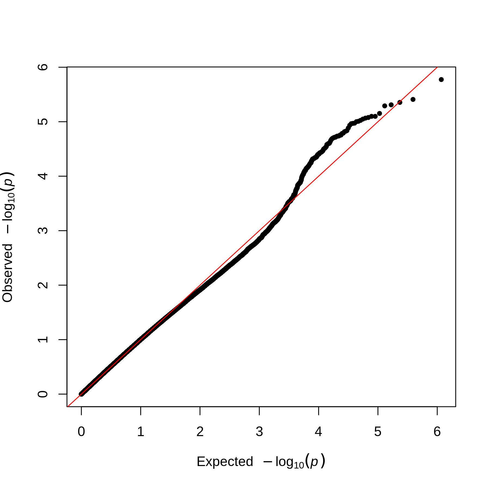

# GWAS-tutorial

This repository contains the tutorial for conducting main quality control steps and association testing for the genome-wide association studies (GWAS). It includes:
1. Checking sex of samples
2. Filtering samples and variants for missingness, filtering variants for Hardy-Weinberg equilibrium and minor allele frequency
3. Search for relatives
4. Principal component analysis
5. Association testing

For imputation, please refer to the [imputation-tools](https://github.com/oborisov/imputation-tools)

## Prerequisites
*GWAS-tutorial* was tested on Ubuntu 18.04.4 LTS. It requires a number of packages that can be installed using conda ([Miniconda 3](https://docs.conda.io/en/latest/miniconda.html) should be sufficient). The code is implemented in the [jupyter-notebook](https://jupyter.org/).


## Installation
```
git clone https://github.com/oborisov/GWAS-tutorial.git  
cd GWAS-tutorial
gunzip data/GSA.bim.gz
wget https://people.virginia.edu/~wc9c/KING/Linux-king.tar.gz
tar -xzvf Linux-king.tar.gz && rm Linux-king.tar.gz
wget http://s3.amazonaws.com/plink2-assets/alpha2/plink2_linux_x86_64.zip
unzip -o plink2_linux_x86_64.zip && rm plink2_linux_x86_64.zip
wget http://s3.amazonaws.com/plink1-assets/plink_linux_x86_64_20200428.zip
unzip -o plink_linux_x86_64_20200428.zip && rm plink_linux_x86_64_20200428.zip
conda env create -f environment.yml
conda activate GWAS-tutorial
```

## Running
```
jupyter-notebook GWAS-tutorial.sos.ipynb
```

## Output
*GWAS-tutorial* produces Manhattan and Q-Q plots:



### used software
[PLINK 1.9](https://www.cog-genomics.org/plink/1.9)  
[PLINK 2.0](https://www.cog-genomics.org/plink/2.0)  
[king](https://people.virginia.edu/~wc9c/KING/manual.html)  
[qqman](https://cran.r-project.org/web/packages/qqman/index.html)
